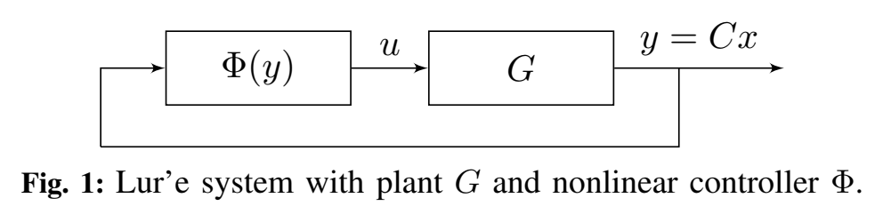
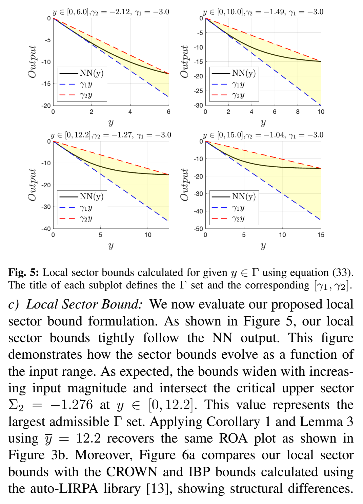
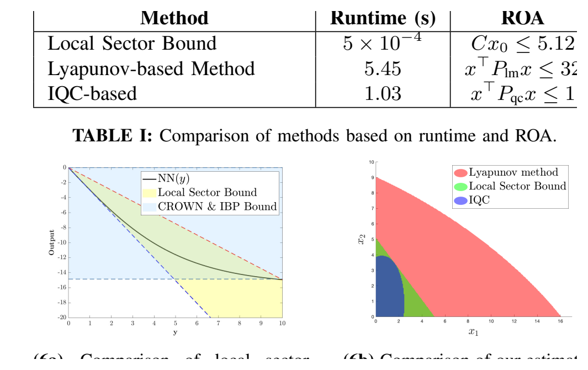

# Local Stability and Region of Attraction Analysis for Neural Network Feedback Systems under Positivity Constraints

Code accompanying the paper:

> H. Montazeri Hedesh, M. K. Wafi, and M. Siami,
> **"Local Stability and Region of Attraction Analysis for Neural Network Feedback Systems under Positivity Constraints,"**
> *2025 IEEE 64th Conference on Decision and Control (CDC)*, Rio de Janeiro, Brazil, 2025, pp. 1142–1149.
> DOI: [10.1109/CDC57313.2025.11312171](https://doi.org/10.1109/CDC57313.2025.11312171)

The paper studies local stability and the Region of Attraction (ROA) of positive Lur'e systems whose static feedback is a feedforward neural network (FFNN). It contributes:

1. a **localized positive Aizerman conjecture** (Lemma 3) giving a linear ROA underapproximation;
2. a **Lyapunov / LMI method** (Section IV, Algorithm 1) that grows invariant quadratic sublevel sets; and
3. a **tight local sector bound for FFNNs** (Theorem 4) obtained by layer-wise propagation of linear relaxations, which plugs into the Aizerman framework.

This repository provides clean, self-contained MATLAB implementations of these methods plus scripts to reproduce the figures of the numerical example.

<p align="center">
  <br>
  <sub><em>Fig. 1 — the neural-network controller in feedback with the positive plant (the Lur'e interconnection analyzed in the paper).</em></sub>
</p>

## At a glance

<p align="center">
  <br>
  <sub><em>Fig. 5 — tight local sector <code>[γ1, γ2]</code> for the FFNN as the input range ȳ grows (6, 10, 12.2, 15). Obtained by layer-wise propagation of linear relaxations (Theorem 4); the sector reaches the stabilizing upper slope Σ₂ = −1.276 exactly at ȳ = 12.2.</em></sub>
</p>

<p align="center">
  <br>
  <sub><em>Fig. 6b — region-of-attraction estimates compared for the example: Lyapunov / Algorithm 1 (red, largest), local sector-bound + positive Aizerman (green), and the IQC baseline [4] (blue, smallest).</em></sub>
</p>

<sub>Figures reproduced from the paper (© IEEE); see the license note below.</sub>

---

## Repository structure

```
local-stability-nn-feedback/
├── src/                         Core library (add this to the MATLAB path)
│   ├── nn_forward.m             FFNN forward pass, Eq. (16)
│   ├── compute_bounds.m         Interval pre-activation bounds, Eqs. (18)-(23)
│   ├── tanh_sector_slopes.m     Per-neuron tanh sector slopes, Eq. (26) / Fig. 2
│   ├── local_sector_bound.m     Local sector bound gamma1, gamma2 — Theorem 4
│   └── load_weights.m           Load the trained controller weights
├── examples/                    Scripts reproducing the paper's results
│   ├── fig2_tanh_relaxation.m       Fig. 2  — tanh linear relaxation cases
│   ├── fig3_nn_sector_and_gamma.m   Fig. 3a — NN output vs. sector, Gamma set
│   ├── aizerman_roa.m               Fig. 3b / Sec. VI-a — local Aizerman ROA + trajectories
│   ├── fig4_lyapunov_roa.m          Fig. 4  / Sec. IV   — Lyapunov LMI ROA (needs YALMIP)
│   ├── fig5_local_sector_bounds.m   Fig. 5  — local sector bounds vs. input range
│   └── fig6_roa_comparison.m        Fig. 6b — ROA comparison across methods
├── benchmarks/
│   └── iqc_based_method.m        IQC baseline [4] (reference only — see header)
├── training/
│   └── train_and_verify.ipynb    NN training + CROWN/IBP bounds (Fig. 6a); see training notes
├── weights/                      Trained 1-10-10-1 tanh controller
│   ├── W1.csv  (10 x 1)
│   ├── W2.csv  (10 x 10)
│   └── W3.csv  (1  x 10)
├── data/                         Sample PID input/output data used for training
│   ├── pid_y.csv
│   └── pid_u.csv
├── docs/
│   └── figures/                 Paper figures embedded in this README
├── LICENSE
├── CITATION.bib
└── README.md
```

---

## Requirements

- **MATLAB** R2019b or newer (uses `contourf`, `sdpvar`, string formatting). No toolboxes required for the sector-bound and Aizerman scripts.
- **[YALMIP](https://yalmip.github.io/)** and an SDP solver (e.g. SeDuMi or SDPT3) — only for `examples/fig4_lyapunov_roa.m`, which solves the LMI (10).
- *(Optional)* **Python** with `torch` and [`auto_LiRPA`](https://github.com/Verified-Intelligence/auto_LiRPA) — only for retraining the controller and reproducing the CROWN/IBP comparison in the training notebook (Fig. 6a).

---

## Quick start

From the `examples/` directory (each script adds `../src` to the path automatically):

```matlab
cd examples

fig2_tanh_relaxation        % Fig. 2  — three tanh relaxation cases
fig3_nn_sector_and_gamma    % Fig. 3a — controller output and sector
aizerman_roa                % Fig. 3b — prints "C x0 <= 5.12" and simulates trajectories
fig5_local_sector_bounds    % Fig. 5  — gamma1, gamma2 as the input range grows
fig6_roa_comparison         % Fig. 6b — the three ROA estimates overlaid
fig4_lyapunov_roa           % Fig. 4  — requires YALMIP + an SDP solver
```

To compute the local sector bound of the shipped controller directly:

```matlab
addpath('src');
W = load_weights('weights');
[g1, g2] = local_sector_bound(W, 0, 12.2)   % -> g1 ~ -3.011,  g2 ~ -1.258
```

---

## Reproducing the numerical example

Plant and sector (Section VI):

```
A = [-7 5; 6 1];   B = [1; 2];   C = [1 1];
Sigma1 = -3       % A + B*Sigma1*C is Metzler
Sigma2 = -1.276   % A + B*Sigma2*C is Hurwitz
```

| Quantity | Paper | This code |
|---|---|---|
| Sector slope at origin, gamma1 | -3 | -3.011 |
| gamma2 reaches Sigma2 at | ybar = 12.2 | ybar ≈ 12.2 |
| Local Aizerman ROA (Lemma 3) | `C x0 <= 5.12` | `C x0 <= 5.08` (with `v_min/v_max ≈ 0.417`) |
| Lyapunov ROA (Algorithm 1) | `x' P_lm x <= 32` | reproduced by `fig4_lyapunov_roa.m` |
| IQC ROA [4] | `x' P_qc x <= 1` | baseline, see `benchmarks/` |

Runtimes reported in Table I: local sector bound `5e-4 s`, Lyapunov `5.45 s`, IQC `1.03 s`.

| Paper item | Script |
|---|---|
| Fig. 2 | `examples/fig2_tanh_relaxation.m` |
| Fig. 3a | `examples/fig3_nn_sector_and_gamma.m` |
| Fig. 3b, Sec. VI-a | `examples/aizerman_roa.m` |
| Fig. 4, Sec. IV, Algorithm 1 | `examples/fig4_lyapunov_roa.m` |
| Fig. 5 | `examples/fig5_local_sector_bounds.m` |
| Fig. 6a (CROWN/IBP) | `training/train_and_verify.ipynb` |
| Fig. 6b | `examples/fig6_roa_comparison.m` |
| Table I (IQC baseline) | `benchmarks/iqc_based_method.m` |

---

## Notes

- **Weights.** `weights/W1.csv, W2.csv, W3.csv` are exactly the trained 1-10-10-1 controller used in the paper. With `Sigma1 = -3` the closed-loop matrix `A + B*Sigma1*C` is Metzler (eigenvalues `-10, -5`), with `Sigma2 = -1.276` it is (marginally) Hurwitz, and the controller leaves the sector precisely at `y ≈ 12.2` — recovering `ybar = 12.2`.
- **Lyapunov script.** Needs YALMIP and an SDP solver; leave the solver field empty (`sdpsettings('solver','')`) to let YALMIP pick whichever you have installed.
- **IQC baseline** (`benchmarks/iqc_based_method.m`) is adapted from Yin et al. [4] and is **not self-contained** — it depends on CVX and helper files from that code base and is included only to document how the Table I / Fig. 6b IQC numbers were produced. See the header of that file.
- **Training notebook** reproduces the CROWN/IBP comparison (Fig. 6a) via `auto_LiRPA`. It is exploratory (structured around library walkthroughs) rather than a one-click pipeline; the trained weights are already provided in `weights/`, so running it is optional. See `training/README.md`.

---

## Citation

If you use this code, please cite the paper (see `CITATION.bib`).

## License

The code is released under the MIT License (`LICENSE`). The paper text and figures (the images under `docs/figures/`) are © IEEE and are included here for reference under the authors' rights to reproduce their own work.
